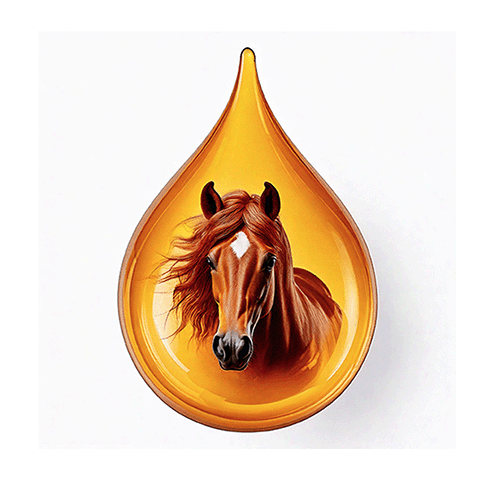

## Equine Infectious Anemia Virus (EIAV) Extension to Lentivirus-GLUE

Welcome to the GitHub repository for **Lentivirus-GLUE-EIAV**: an extension to **[Lentivirus-GLUE](https://github.com/giffordlabcvr/Lentivirus-GLUE)**.

The EIAV extension to EIAV-GLUE incorporates all published EIAV sequence data linked to associated metadata, including information that is sequence-associated (length, publication date); taxonomic (viral genotype, subtype); and isolate-associated (isolation host species, date and location of sampling, isolation source).

For more details please see the Lentivirus-GLUE **[User Guide](https://github.com/giffordlabcvr/Lentivirus-GLUE/wiki/EIAV-Project-Development-Background)**.

## Data Sources

**Lentivirus-GLUE-EIAV** is constructed using sequence data obtained from [NCBI Nucleotide](https://www.ncbi.nlm.nih.gov/nuccore).

## Contributing

We welcome contributions from the community! If you're interested in contributing to Lentivirus-GLUE-EIAV, please review our [Contribution Guidelines](./md/CONTRIBUTING.md).

## License

The project is licensed under the [GNU Affero General Public License v. 3.0](https://www.gnu.org/licenses/agpl-3.0.en.html)

## Contact

For questions, issues, or feedback, please open an issue on the [GitHub repository](https://github.com/giffordlabcvr/Lentivirus-GLUE-EIAV/issues).

* * * * *
